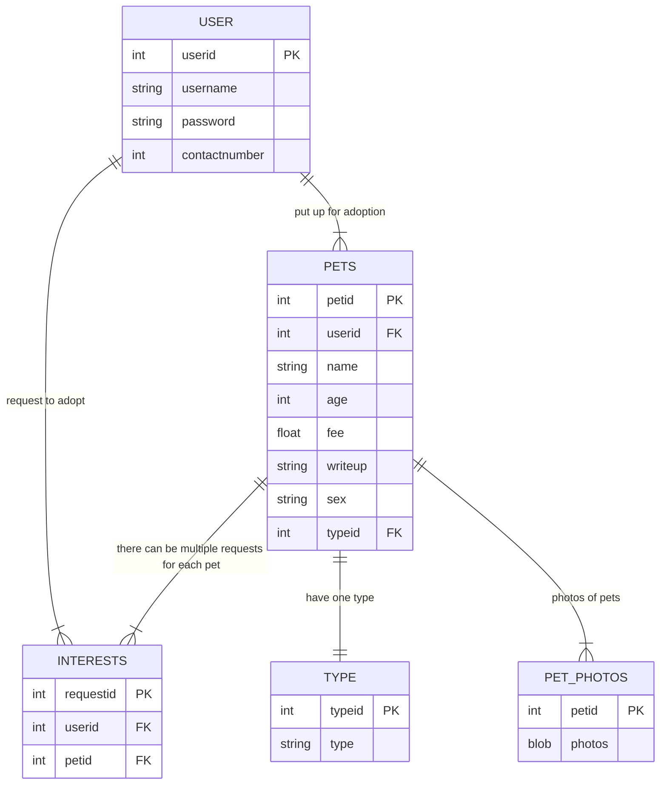

# HCI-Computing-Pet-Adoption-Website

## To Do

- [ ] View pet page
- [ ] Search page
- [ ] Submit interest
- [ ] Delete interest
- [ ] View interest
- [ ] Refactor to use Flask's logging system

---

## Design Requirements
- Design a web application for Pet Adoption.
- The web application will allow adoption of pet (eg. Dog, cat, etc)
- Each pet has
  - Name
  - Photographs of the Pet – up to 3 photos
  - Sex
  - Age
  - Fee ‐ adoption fee
  - Short write up of the pet
  - Type of pet – Dog, Cat, Reptile, Bird, Other
- Allow owners of the pet to post their pet for adoption, edit their post or delete their post
- Allow interested parties to submit their interest by providing their name, contact number. Each Pet can have multiple submissions of interested parties.
- The website should have a page to list down all the pets for adoption based on the type.
  - Search with filters 
- Allow owners of the pet to view the list of interested parties.
- Have it not look like trash

## Entity-Relationship Diagram

